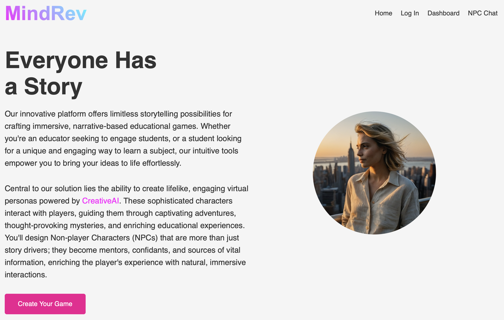
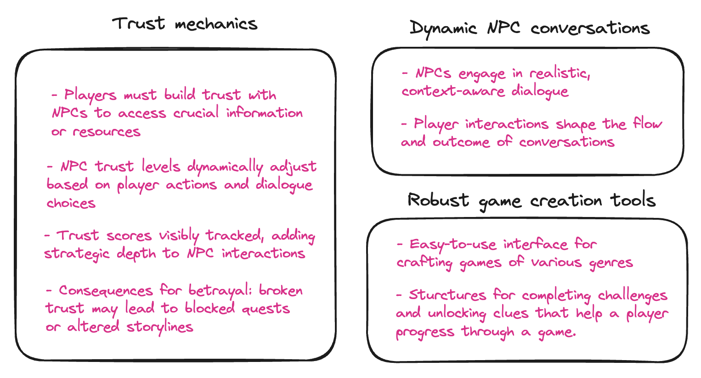
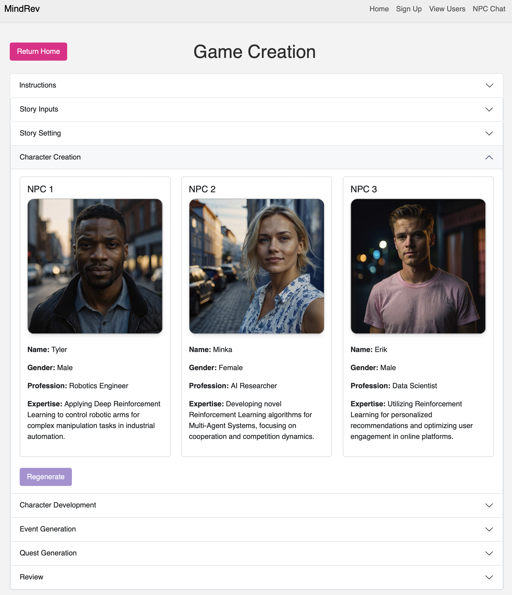
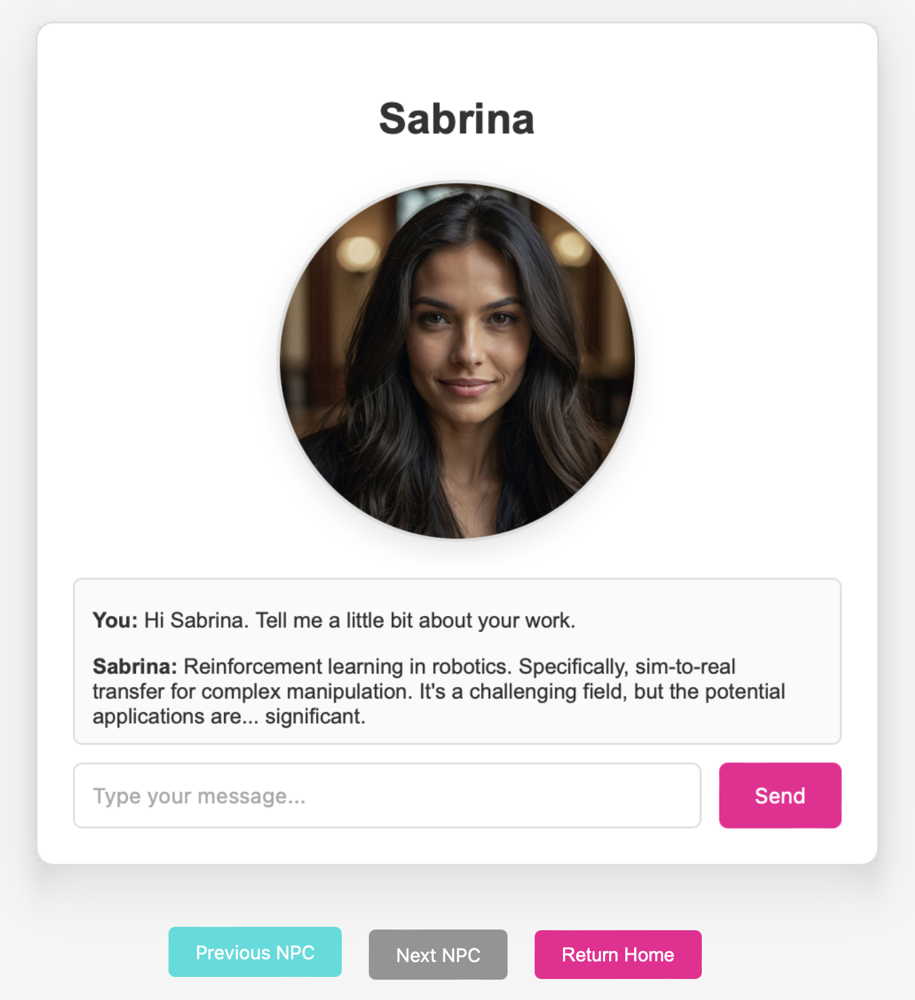
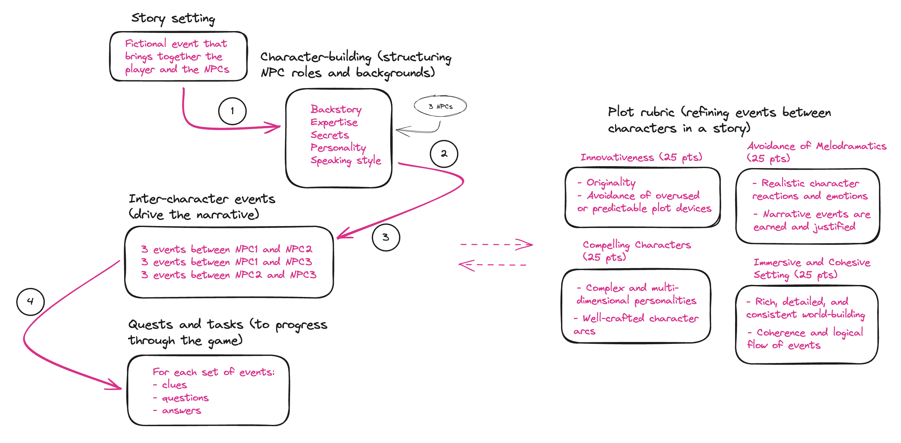

# MindRev

The MindRev platform offers limitless storytelling possibilities for crafting immersive, narrative-based educational games. Whether you're an educator seeking to engage students or a student looking for a unique and engaging way to learn a subject, our intuitive tools empower you to bring your ideas to life effortlessly.

Central to our solution lies the ability to create lifelike, engaging virtual personas powered by CreativeAI. These sophisticated characters interact with players, guiding them through captivating adventures, thought-provoking mysteries, and enriching educational experiences. You'll design Non-Player Characters (NPCs) that are more than just story drivers; they become mentors, confidants, and sources of vital information, enriching the player's experience with natural, immersive interactions.

 

## Mission

To empower users to create and enjoy immersive educational games, leveraging the power of generative tools to bring stories and characters to life.

## Vision

To become a leading platform for AI-driven interactive storytelling, revolutionizing how people create, share, and experience educational games.

## Market Segment

**PRIMARY**
Educational content creators

**SECONDARY**
Students seeking innovative ways to study through immersive interactive text-based games

**TERTIARY**
Gaming studios leveraging our tech to enhance their game/story creation process; Educational institutions interested in developing engaging, interactive lesson content

## Key Features

MindRev offers powerful game creation tools that enable developers to effortlessly generate complete plots and stories for interactive games. These tools include a structured system for implementing challenges and clues that guide player progression. Additionally, MindRev features dynamic NPC conversations, allowing for context-aware dialogue with in-game characters who display distinct personalities and realistic emotional responses.

A key innovation of MindRev is the implementation of trust mechanics. This feature allows developers to control NPC behavior and the information they share with players. Players must build trust with NPCs to access vital information and resources. Trust levels dynamically adjust based on player actions and dialogue choices, with consequences for broken trust. This mechanic adds depth to player-NPC interactions and enhances overall gameplay immersion.

 
 

## Character Creation

 

 ---

 
 

## Plot Generation

Our concept involves developing customized plot generation templates for various text-based game genres. Different templates would be available, each tailored to a specific type of game you wish to create. For example, you could select a template for an educational game where the characters are professors or researchers in your chosen educational topic. One quest could be to prove to an NPC that you understand a concept. If you successfully prove your understanding, the NPC will provide you with clues to advance the game. 

Our plot generation process uses Plot Rubric, an iterative refinement system that employs two specialized AI models: a Creative Agent to develop characters and storylines, and a Critic Agent to evaluate and improve them. This approach ensures compelling plots and well-developed characters.

 
### Events

- We construct what we call **inter-character events**; this is a device we use to drive the narrative within the structure of a text-based interactive game.
- Events are stored away; game progression determines what information is fed to which NPC at which time.

---

## Attribution

- Our app was built on Flask, with help from [Flask_Blog - Corey Schafer](https://github.com/CoreyMSchafer/code_snippets/tree/master/Python/Flask_Blog).
